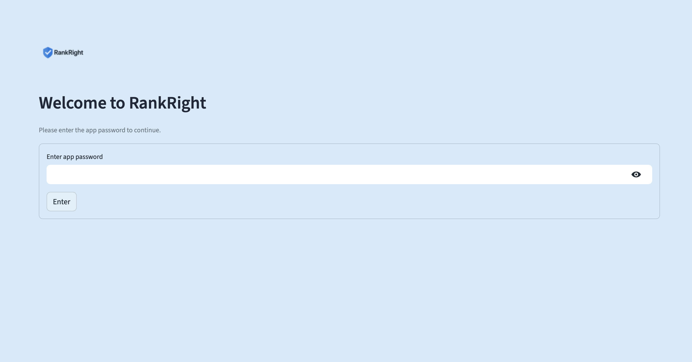
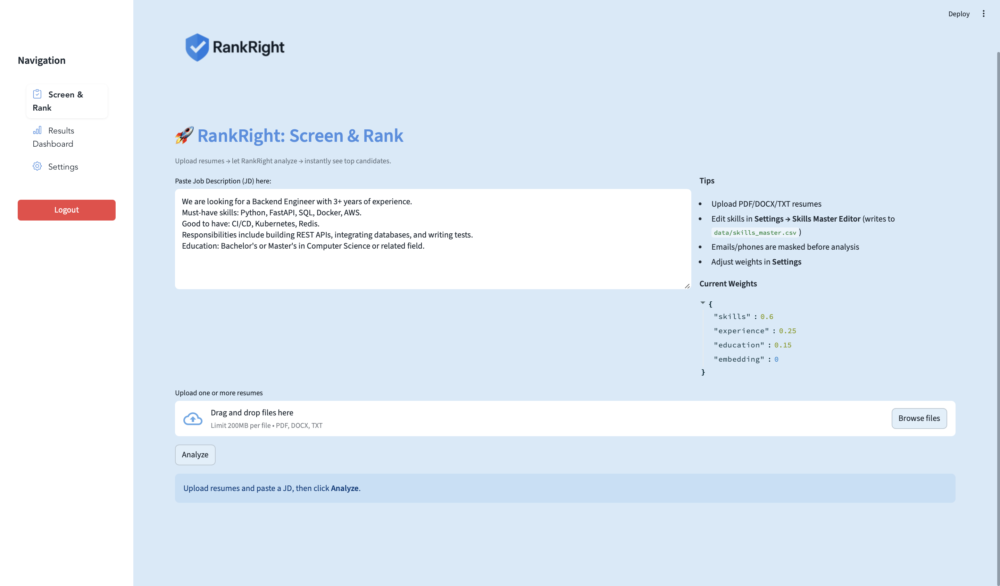
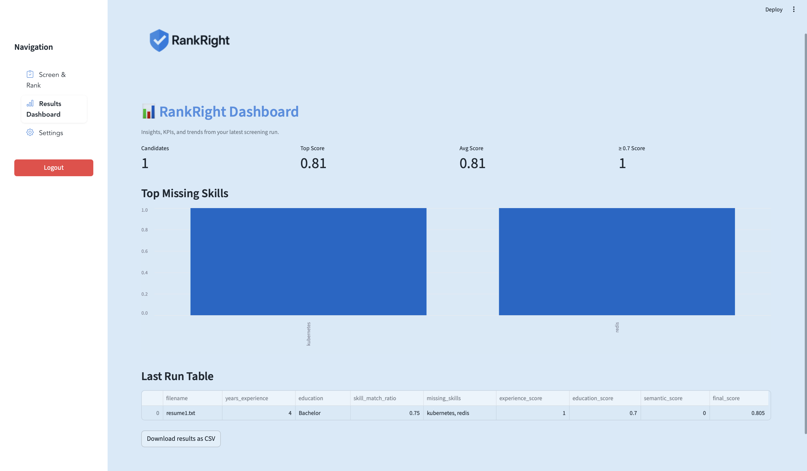
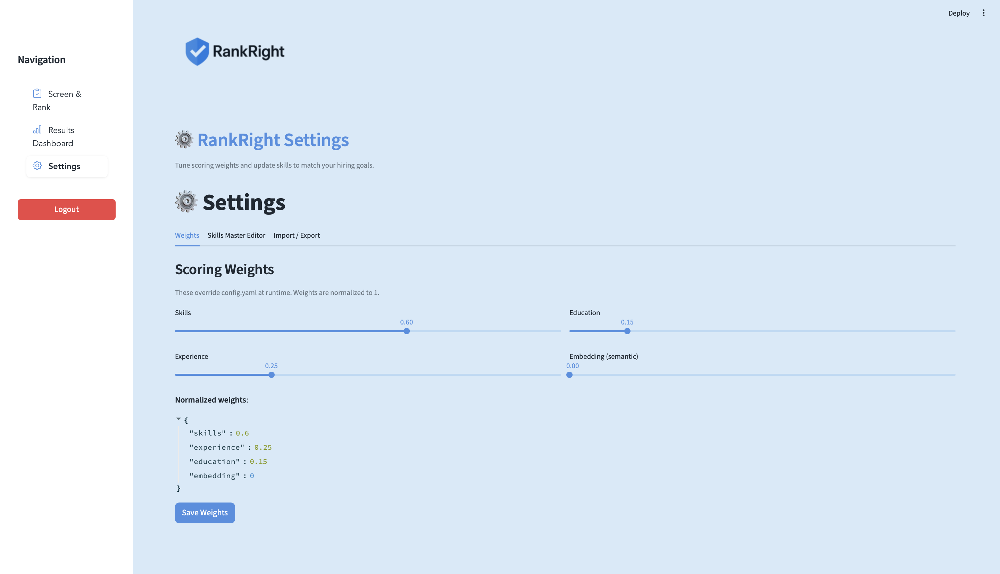

# RankRight  

**Tagline:** *"AI-powered resume screening and ranking for smarter, faster, and fairer hiring."*  

## 📌 Overview  
RankRight is an **AI-driven resume screening and ranking tool** that helps recruiters streamline hiring. Instead of manually reviewing hundreds of resumes, RankRight uses **Natural Language Processing (NLP)** and **Machine Learning (ML)** to parse resumes, extract key skills, and match them with job descriptions. It then ranks candidates based on relevance, ensuring the best-fit profiles are prioritized.  

## ✨ Features  
- 📄 **Automated Parsing** – Extracts skills, education, and experience from resumes.  
- 🎯 **Smart Ranking** – Scores and sorts resumes against job descriptions.  
- 📊 **Interactive Dashboard** – Built with **Streamlit**, providing skill match insights, ranking visualizations, and candidate comparisons.  
- 🔍 **Explainable Results** – Transparent ranking logic to support recruiter decisions.  
- ⚡ **Customizable & Scalable** – Adaptable across industries and job roles.  

## 🛠️ Tech Stack  
- **Frontend & Dashboard:** Streamlit, Streamlit-Option-Menu  
- **Backend & Core Logic:** Python  
- **AI / NLP:** NLTK, spaCy, Scikit-learn  
- **Data Processing:** Pandas, NumPy  
- **Visualization:** Matplotlib, Seaborn  
- **Version Control:** Git, GitHub  

## 🚀 Workflow  
1. Upload resumes and job description.  
2. RankRight processes text using NLP techniques.  
3. ML algorithms score and rank candidates.  
4. Results are visualized in an interactive dashboard.  

## 🎯 Why RankRight?  
RankRight saves time, reduces manual effort, and improves fairness in recruitment. It empowers HR teams with **data-driven insights** while ensuring no qualified candidate is overlooked—making hiring **smarter, faster, and more inclusive**.  


## 📸 Screenshots  

### Logo View
  

### login View
  


### Dashboard View  
  

### Resume Ranking Example  
  

### Candidate Insights  
  

### Logout View
  

## Quick Start

### 1) Create & activate a virtual environment
**macOS / Linux**
```bash
cd ai_resume_screener
./scripts/bootstrap_macos.sh
```
**Windows (PowerShell)**
```powershell
cd ai_resume_screener
scripts\bootstrap_windows.bat
```

> The script installs dependencies and downloads the spaCy model `en_core_web_sm`.

### 2) Run the app
```bash
streamlit run app/streamlit_app.py
```

Open the local URL shown in the terminal.

### 3) Try the samples
- Paste `data/samples/jd_backend.txt` into the JD box
- Upload `data/samples/resume1.txt` and `resume2.txt`

## Features
- PDF/DOCX/TXT parsing
- Skill extraction via spaCy PhraseMatcher + skills CSV
- Basic experience & education parsing
- Weighted scoring (configurable in `config.yaml`)
- CSV export of ranked candidates
- Optional semantic similarity (Sentence-Transformers)

## Enable embeddings (optional)
Set `embedding` weight > 0 in `config.yaml` and ensure the first run downloads the model:
```python
from sentence_transformers import SentenceTransformer
model = SentenceTransformer("all-MiniLM-L6-v2")
```

## Notes
- Edit `data/skills_master.csv` to expand the skills list.
- This MVP focuses on clarity and simplicity. Improve with better NER, custom skills, and more features over time.
